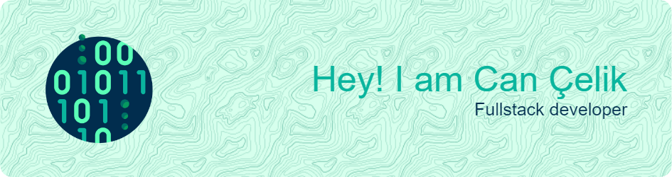
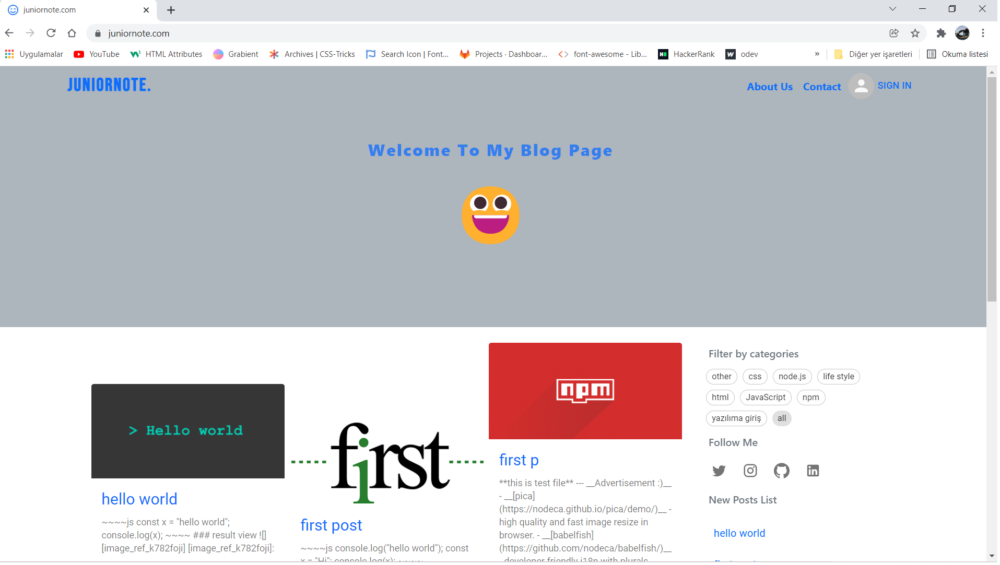
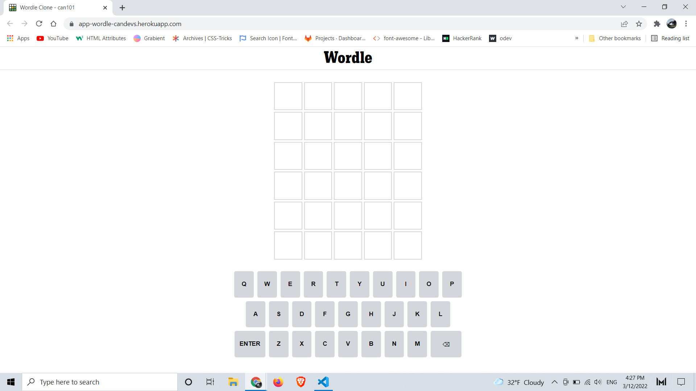
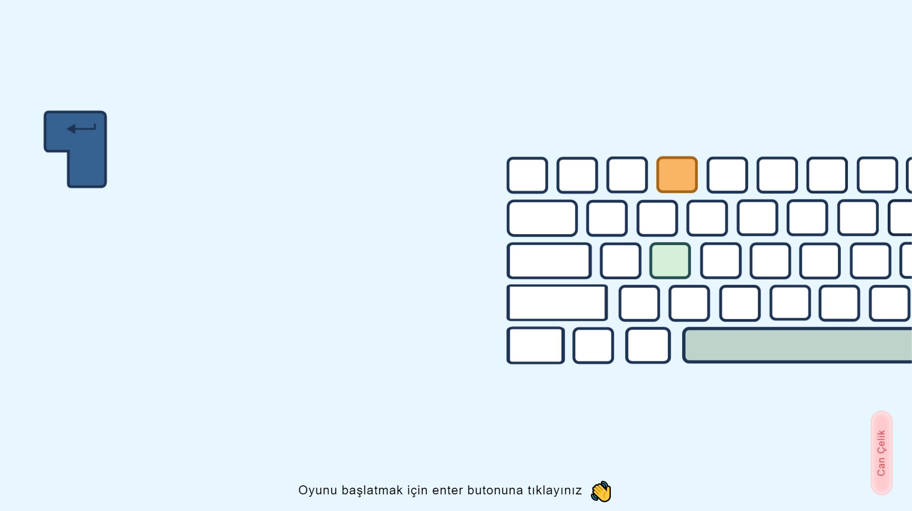
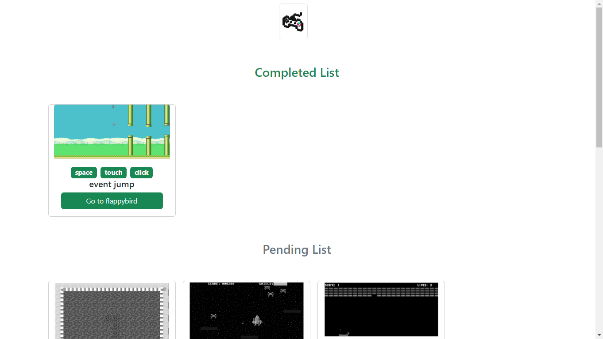
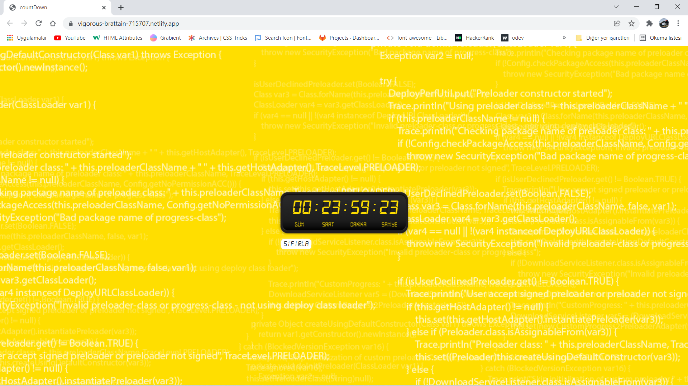
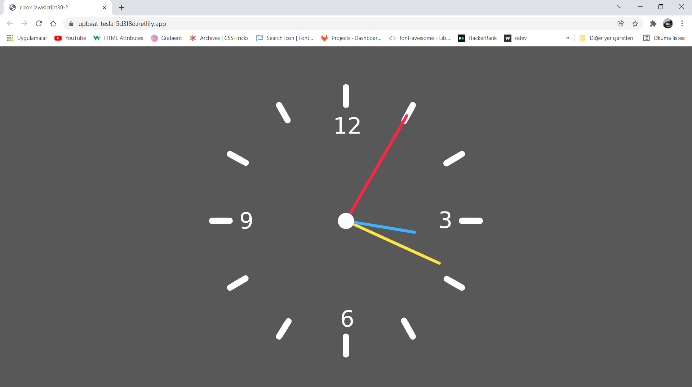

<!-- <div style="display:flex;justify-content:right;padding:10px;"> -->
<!-- <a href="dark_readme.md"/> -->
<!--  -->
<!-- <a> -->
<!-- </div> -->

<!--  -->

<!-- about me -->
## About Me
```My name is Can Çelik. I am 22 years old. I live in Istanbul, Turkey and I am studying computer programming at the university. I am a curious person and I love to learn. I am working on improving my skills in web development. I am in support of open-source software. I am sharing my studies and projects on GitHub. I am writing code.```
<!-- skills -->
 ## Front-End Development Toolls

 ## Backend-End Development Toolls
  
 ## Deployment Toolls
 
## Development Environment Tools

## Design Tools


<!--  -->

<!-- ## GitHub Stats -->
<!-- git status -->
<!--  -->

<!-- ## Top Langs -->
<!-- top alngs -->
<!--  -->
<!-- ## GitHub Profile Tropy -->
<!-- trophy -->
<!--  -->
<!-- ## GitHub Streak -->
<!-- streak -->

<!--  -->

<!-- ## Published Projects -->

<!-- juniornote.com -->
<!--  ## juniornote.com -->
 
<!-- <a href="https://juniornote.com/" style="width:45%; margin:5px;"> -->
<!--  -->
<!-- </a> -->
 
<!--  > My blog web site -->
 
<!-- Wordle Clone -->
 
<!--  ## Wordle Clone -->
 
<!-- <a href="https://wordle-can-hero.netlify.app" style="width:45%; margin:5px;"> -->
<!--  -->
<!-- </a> -->
 
<!--   > Wordle video game -->
 
<!-- keyboard speed game -->
 
<!--   ## Keyboard Speed Game -->
 
<!-- <a href="https://keyboard-speed-game-cancelik.vercel.app/" style="width:45%; margin:5px;"> -->
<!--  -->
<!-- </a> -->
 
<!--   > Video game -->
 
<!-- game list -->
<!--   ## Game List -->
 
<!-- <a href="https://can101-games.herokuapp.com/" style="width:45%; margin:5px;"> -->
<!--  -->
<!-- </a> -->
 
<!--  > Small game list -->
 
<!-- count down -->
<!--   ## Count Down -->
 
<!-- <a href="https://downcounter.netlify.app/" style="width:45%; margin:5px;"> -->
<!--  -->
<!-- </a> -->
 
<!--   > Countdown example -->
 
<!-- Wall Clock -->
<!-- <a href="https://wallclock101.netlify.app/" style="width:45%; margin:5px;">  -->

<!--  ## Wall Clock   -->
 
<!--   -->
<!-- </a> -->
 
<!--  > Wall clock example -->

<!-- ## Connect With Me -->
<!-- [](https://discord.gg/Dz3sUFK5Ch) -->
<!-- [](https://www.instagram.com/celikcan529/) -->
<!-- [](https://www.linkedin.com/in/can101/) -->
<!-- [](https://twitter.com/Canelik24386471) -->
<!--   -->
