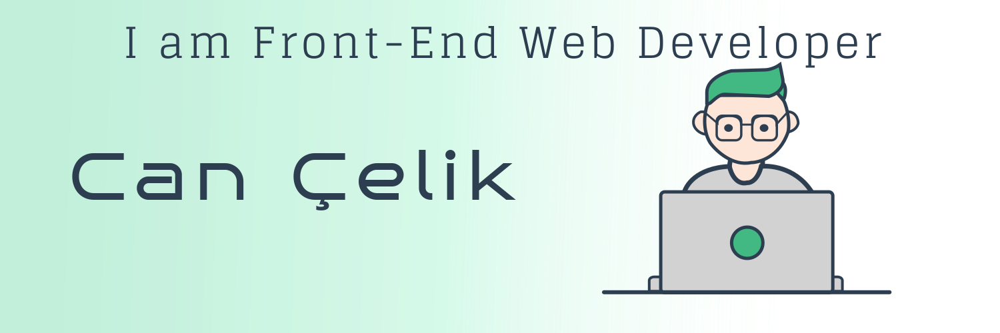
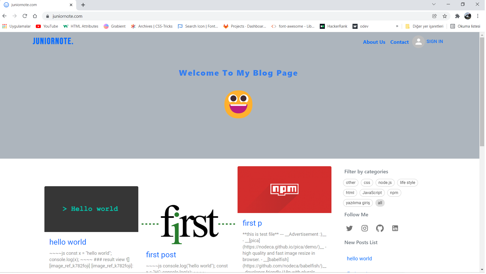
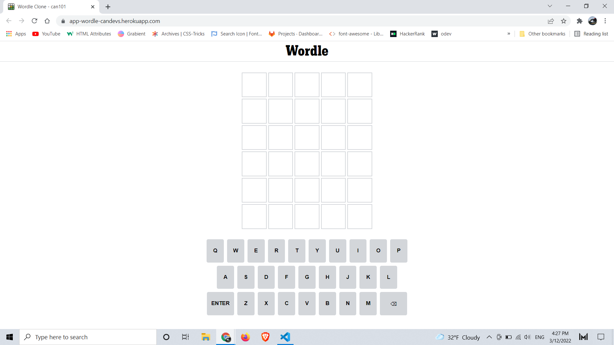
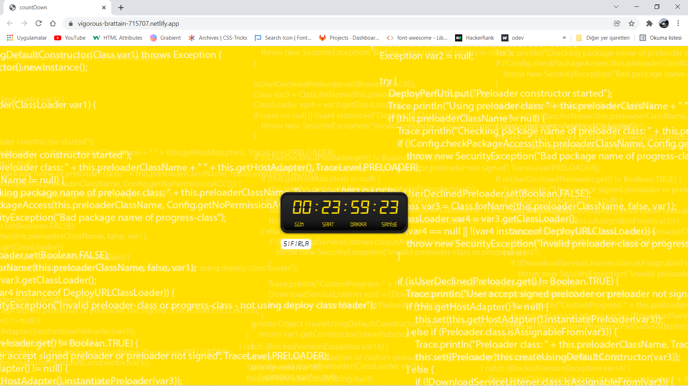
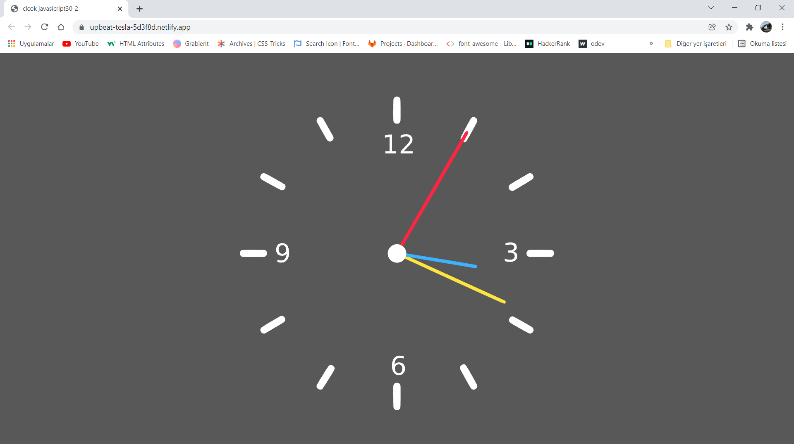

<!-- <h1 align="center">Hi 👋, I'm Can</h1>
<h3 align="center">A passionate frontend developer from Turkey</h3> -->

 
  

- 🔭 I’m currently working on **home**

- 🌱 I’m currently learning **graphql security and c#**

- 👯 I’m looking to collaborate on **OpenSource Projects**

- 🤝 I’m looking for help with **front-end intern**

- 👨‍💻 All of my projects are available at [https://juniornote.com/aboutus](https://juniornote.com/aboutus)

- 📝 I regularly write articles on [https://juniornote.com](https://juniornote.com)

- 📫 How to reach me **ccan6835@gmail.com**

- ⚡ Fun fact **I am curious person and love to learn.I develop myself in web programming and web design.**
<!-- <!-- about me begin --------------------------------------- -->
<h2 style="color:#90979A;">About me</h2>

my name is Can Çelik. I am 21 years old. I live in Istanbul, Turkey. I study computer programming at the university.I am curious person and love to learn.I develop myself in web programming and web design. 

<!--  about me end ----------------------------------------->

<!-- published projects begin -->
<h2 style="color:#90979A;">Published Projects</h2>
<h4>juniornote.com</h4>

my blog web site

<h4>Wordle Clone</h4>

Wordle video game

<h4>CountDown</h4>

countdown example

<h4>Wall Clock</h4>

wall clock example

<!-- published projects end -->

<h2 align="left" style="color:#90979A;">Connect with me</h2>

<h2 align="left" style="color:#90979A;">Languages and Tools</h2>

                                

